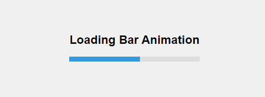

# Simple Page Loading Bar Animation




This project demonstrates a simple page loading bar animation using CSS only. It includes a centered block with a loading bar and a title.

## Features

- **Title:** Displayed at the top of the page.
- **Loading Animation:** A spinner animation in the center of the page.
- **Responsive Design:** Centered content adjusts based on screen size.

## How to Use

1. Clone the repository: `https://github.com/coderooz/Simple-Page-Loading-Bar-Animation`
2. Open `index.html` in a web browser.


### Project Structure

```
project-folder/
│
├── index.html
├── style.css
└── README.md
```

### Code in the project
### index.html

```html
<!DOCTYPE html>
<html lang="en">
<head>
  <meta charset="UTF-8">
  <meta name="viewport" content="width=device-width, initial-scale=1.0">
  <title>Loading Bar Animation Example</title>
  <link rel="stylesheet" href="style.css">
</head>
<body>
  <div class="container">
    <h1>Loading Bar Animation</h1>
    <div class="loader-bar"></div>
  </div>
</body>
</html>
```

### style.css

```css
/* Reset some default styles */
* {
margin: 0;
padding: 0;
box-sizing: border-box;
}

/* Center the content vertically and horizontally */
html, body {
height: 100%;
display: flex;
justify-content: center;
align-items: center;
background-color: #f0f0f0;
}

.container {
text-align: center;
}

h1 {
font-family: Arial, sans-serif;
font-size: 24px;
margin-bottom: 20px;
}

.loader-bar {
width: 100%;
height: 10px;
background-color: #ddd;
position: relative;
}

.loader-bar::after {
content: '';
display: block;
width: 50px;
height: 100%;
background-color: #3498db;
position: absolute;
animation: progress 2s ease-in-out infinite;
}

@keyframes progress {
0% { width: 0; }
50% { width: 50%; }
100% { width: 100%; }
}
``` 

## Credits

- CSS spinner animation inspired by various online examples.
- Designed and implemented by Coderooz [Ranit Saha].

## License

This project is licensed under the MIT License - see the LICENSE file for details.
